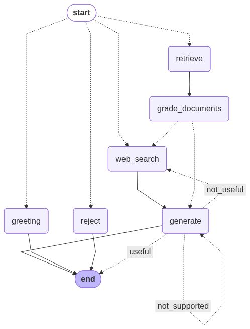

# Agentic RAG

## Description
Using LangGraph to build agentic workflow based on
- Corrective-RAG (CRAG) paper uses self-grading on retrieved documents and web-search fallback if documents are not relevant.
- Self-RAG paper adds self-grading on generations for hallucinations and for ability to answer the question.
- Adaptive RAG paper routes queries between different RAG approaches based on their complexity.


LangGraph built-in mermaid visualization


## Installation

To get started, follow these steps:

1. **Clone the repository**:
    ```sh
    git clone https://github.com/gotsulyakk/agentic-rag.git
    cd agentic-rag
    ```

2. **Install dependencies**:
    [Poetry](https://python-poetry.org/) is recommended for dependency management.
    ```sh
    poetry install
    ```

3. **Set up environment variables**:
    Create a `.env` file in the root directory and add necessary environment variables.
    ```sh
    DEEPSEEK_API_KEY
    TAVILY_API_KEY
    LANGCHAIN_API_KEY
    LANGCHAIN_TRACING_V2
    LANGCHAIN_PROJECT
    
    # Optional: DeepSeek rate limit configuration (default: 100 requests/minute)
    DEEPSEEK_RATE_LIMIT_PER_MINUTE=100

    # Database connection (defaults align với backend `api-edtech`)
    RAG_DB_HOST=localhost
    RAG_DB_PORT=5432
    RAG_DB_NAME=postgres
    RAG_DB_USER=postgres
    RAG_DB_PASSWORD=postgres

    # Tùy chọn cho vector store
    CHROMA_COLLECTION_NAME=rag-edtech
    CHROMA_PERSIST_DIR=.chroma
    RAG_CHUNK_SIZE=700
    RAG_CHUNK_OVERLAP=120
    USER_AGENT=agentic-rag/0.1 (local)
    
    # Knowledge base directory (optional, defaults to ./knowledge-base)
    KNOWLEDGE_BASE_DIR=./knowledge-base
    ```

## Usage

To run the main application:

```sh
cd agentic_rag
poetry run python main.py
```

To launch the Gradio UI:

```sh
cd agentic_rag
poetry run python ui.py
```

To run the FastAPI server:

```sh
cd agentic_rag
poetry run python run_api.py
```

Or directly:

```sh
poetry run uvicorn agentic_rag.api:api_app --host 0.0.0.0 --port 8002 --reload
```

**Note:** The RAG API runs on port **8002** to avoid conflict with the Spring Boot backend (port 8000).

The API will be available at `http://localhost:8002`
- API docs: `http://localhost:8002/docs` (Swagger UI)
- Alternative docs: `http://localhost:8002/redoc` (ReDoc)

## Knowledge Base

The RAG system includes a knowledge base built from markdown files located in the `knowledge-base/` directory. These files contain guides and documentation for both instructors and students.

### Knowledge Base Structure

- `instructor-guide/`: Guides for course creators
- `user-guide/`: Guides for students and learners  
- `faq/`: Frequently asked questions

### Ingestion

Knowledge base files are automatically ingested when running the ingestion script. The system:
- Loads all `.md` files from the knowledge base directory
- Extracts titles and categories from file structure
- Creates vector embeddings using FastEmbed (local, no API costs)
- Makes content searchable through the RAG system

See `knowledge-base/README.md` for more details about the knowledge base structure and content.

## API Endpoints

### POST `/api/v1/rag/ask`

Ask a question to the Agentic RAG system.

**Request Body:**
```json
{
  "question": "What is React?",
  "user_id": "optional-user-uuid",
  "chat_history": [
    {
      "question": "Hello",
      "answer": "Hi! How can I help you?"
    }
  ]
}
```

**Response:**
```json
{
  "answer": "React is a JavaScript library...",
  "trace": "---ROUTE QUESTION---\n...",
  "sources": [
    {
      "source": "course_123",
      "title": "React Fundamentals",
      "course_id": "course_123",
      "course_name": "React Fundamentals",
      "chapter_id": "chapter_456",
      "chapter_name": "Introduction",
      "lesson_id": "lesson_789",
      "lesson_name": "What is React?",
      "metadata": {}
    }
  ],
  "chat_history": [
    {
      "question": "What is React?",
      "answer": "React is a JavaScript library..."
    }
  ]
}
```

## Acknowledgements

- https://www.youtube.com/watch?v=NZbgduKl9Zk
- https://www.youtube.com/watch?v=zXFxmI9f06M
- https://github.com/mistralai/cookbook/tree/main/third_party/langchain